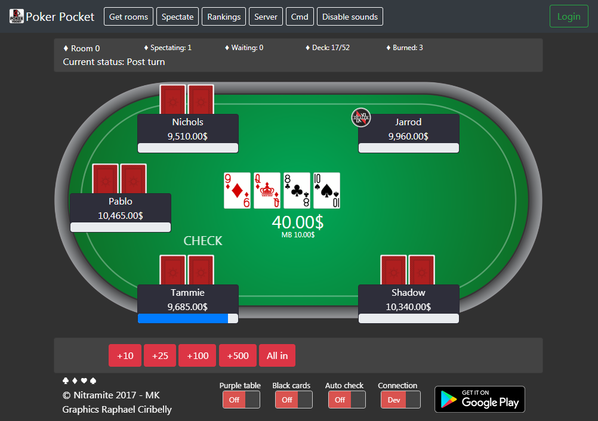

# Poker Pocket Web Client

Nitramite Poker Pocket poker game web front end is <b>old</b> web project which brings web ui for following game
backend:
[Poker-Pocket-Backend](https://github.com/norkator/Poker-Pocket-Backend)

Public production version of this UI is here: [Poker Pocket Web UI](https://pokerpocket.nitramite.com/)

Google Play Poker Pocket
application: [Google Play App](https://play.google.com/store/apps/details?id=com.nitramite.pokerpocket)

I have not developed this anymore in long time and only updates this receive
is related to keep this demo running.

Table of contents
=================

* [Requirements](#requirements)
* [Contributions](#contributions)
* [Authors](#authors)
* [Contributors](#contributors)
* [License](#license)

 

Requirements
============

1. Get [Poker-Pocket-Backend](https://github.com/norkator/Poker-Pocket-Backend) and set it up running on local machine.
2. You need way of hosting folder `/web-client` contents. For example use IDE integrated web host if it has one.
3. Toggle web UI toggle named `Connection` to Dev side or just connect to production leaving it default.

Contributions
============

* Feel free to format code since it's old or do what ever you want. I review pull requests and make releases if needed.
  * If I would be able to develop this again, I would use React, Vue, Angular or something similar.

Authors
============

* **Norkator** - *Initial work* - [norkator](https://github.com/norkator)

Contributors
============
None so far.

License
============
MIT
